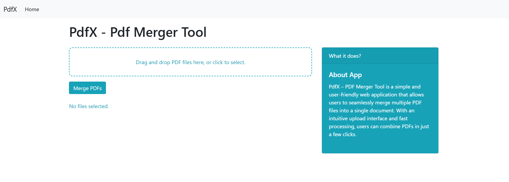

  

## 🔹App Description
PdfX – PDF Merger Tool is a simple and user-friendly web application that allows users to seamlessly merge multiple PDF files into a single document. 
With an intuitive upload interface and fast processing, users can combine PDFs in just a few clicks. 
Whether for work, study, or documentation purposes, PdfX streamlines the task of managing and organizing PDF files efficiently.

## 🔹 Optional Features to Highlight
- Drag-and-drop or multiple file upload support
- Automatically names the merged file with a timestamp

